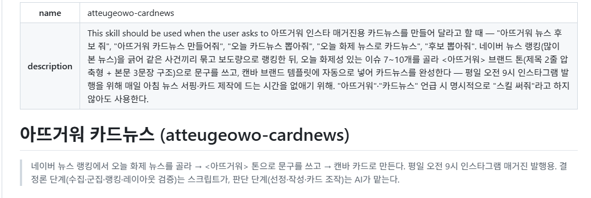
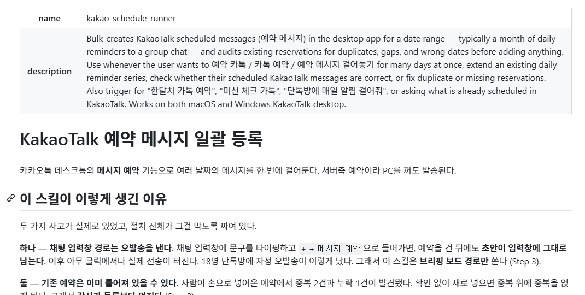

# Claude Code 업무 자동화 스킬

Claude Code 스킬로 만든 반복 업무 자동화 2종을 소개합니다. 상세 절차와 스크립트는 비공개 저장소에서 관리하며, 아래는 각 스킬 정의 문서(`SKILL.md`)의 첫 화면입니다.

## 1. 아뜨거워 카드뉴스 (`atteugeowo-cardnews`)

네이버 뉴스 랭킹에서 오늘 화제 뉴스를 골라 브랜드 톤으로 문구를 쓰고, 캔바 카드로 만들어 주는 스킬입니다. 평일 오전 9시 인스타그램 매거진 발행용입니다.

- 수집·군집·랭킹·레이아웃 검증은 스크립트가 처리합니다.
- 선정·작성·카드 조작은 AI가 맡습니다.
- 매일 아침 뉴스 서핑과 카드 제작에 드는 시간을 없애는 것이 목적입니다.

## 2. 카카오톡 예약 메시지 일괄 등록 (`kakao-schedule-runner`)

카카오톡 데스크톱의 예약 메시지 기능으로 여러 날짜의 메시지를 한 번에 등록하는 스킬입니다. 등록 전에 기존 예약의 중복, 누락, 날짜 오류를 먼저 점검합니다.

- 한 달치 일일 알림 같은 반복 발송을 한 번에 예약합니다.
- 오발송과 중복 예약을 막도록 절차를 짰습니다. 실제로 겪은 사고가 절차에 반영되어 있습니다.
- macOS와 Windows 카카오톡 데스크톱에서 동작합니다.

